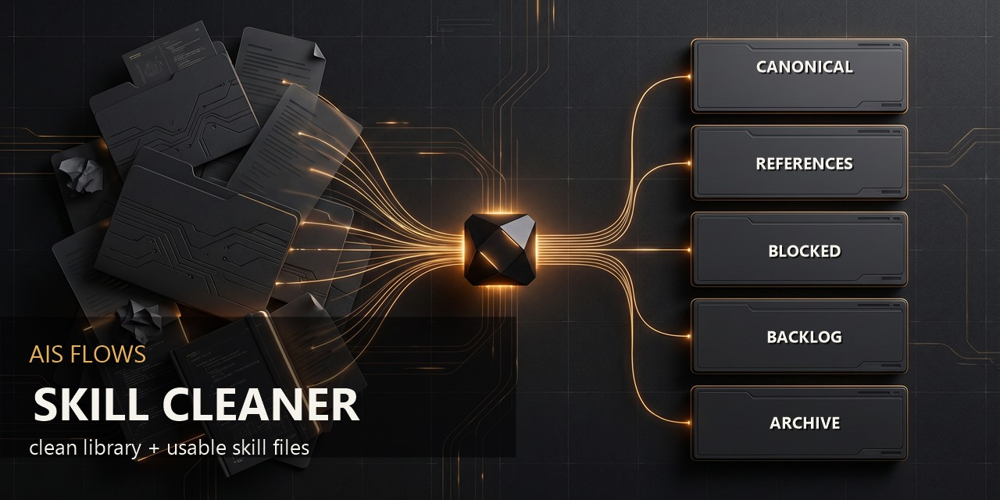

# AIS FLOWS Skill Library Cleaner



Turn scattered AI-agent skills into a clean, compact, readable library and usable skill files.

Status: v0.1.0 public preview / end-to-end cleaner / no permanent delete.

## 30-Second Brief

Skill Cleaner is for people collecting AI-agent skills faster than they can keep them organized.

Give one agent chat a folder of scattered skills. The connected six-skill pack inventories, blocks risky items, finds duplicates, normalizes useful material, writes a clean output library, and verifies the final map.

You get:

```text
skill-library-cleaner-output/clean-library
usable canonical SKILL.md files
FINAL_LIBRARY_MAP.md
```

It does not permanently delete source files, install unknown packages, or execute unknown skills.

## Promise

```text
scattered AI-agent skills -> clean-library/ + usable SKILL.md files
```

The pack does not stop at a report. It creates a clean-library output with canonical skills, references, backlog, blocked items, archive, and final map.

It can also create approved normalized `SKILL.md` outputs inside the clean library. That means it can turn scattered skill material into usable canonical skill files. It does not promise arbitrary new skill generation from scratch in this public preview.

## How It Works

Skill Cleaner is not one magic skill and not a loose collection of unrelated skills. It is a six-skill pack, and the agent chat/session acts as the orchestrator.

Use model:

```text
Connect AIS FLOWS Skill Library Cleaner to an agent chat/session.
Give the chat an AI-agent skills folder path.
The chat runs the six-skill workflow.
The pack writes a safe output library:
skill-library-cleaner-output/clean-library
The result is a clean working library with usable SKILL.md files and a final map.
```

The public preview gives the user a finished output library while keeping the original source folder intact. It does not silently rewrite the real installed skills folder and avoids permanent deletion.

## What It Produces

```text
skill-library-cleaner-output/
  clean-library/
    canonical/
    references/
    backlog/
    blocked/
    archive/
  reports/
    INVENTORY.md
    RISK_BLOCKLIST.md
    DEDUP_GROUPS.md
    CANONICAL_LIBRARY_PLAN.md
    APPLY_PLAN.md
    APPLY_REPORT.md
    FINAL_LIBRARY_MAP.md
    VERIFY_REPORT.md
  machine/
    INVENTORY.json
    RISK_BLOCKLIST.json
    DEDUP_GROUPS.json
    CANONICAL_LIBRARY_PLAN.json
    APPLY_PLAN.json
    APPLY_REPORT.json
    FINAL_LIBRARY_MAP.json
```

## Workflow

```text
Inventory -> Risk Block -> Dedupe & Cluster -> Normalize & Canonicalize -> Apply & Archive -> Verify & Final Map
```

## Modules

| step | module | role |
|---:|---|---|
| 1 | Inventory | Scan the folder and create a no-run inventory. |
| 2 | Risk Block | Separate risky install/runtime/API/credential/browser/package-script items. |
| 3 | Dedupe & Cluster | Find duplicates, runtime copies, old variants, weak forks, and overlap groups. |
| 4 | Normalize & Canonicalize | Choose clean names, categories, descriptions, and final targets. |
| 5 | Apply & Archive | Create clean output, archive duplicates, route references/backlog/blocked, and keep rollback. |
| 6 | Verify & Final Map | Prove the clean library is readable, compact, and no risky item is active. |

## Safety

- No third-party install.
- No `npx`, `npm install`, package scripts, setup scripts, unknown binaries, provider/API calls, cookies, browser profiles, tokens, or `.env` access.
- No permanent deletion in this public preview.
- Duplicate/noisy/old files are routed to `archive/` in the clean output when exact-duplicate confidence and approval are sufficient.
- Risky files are routed to `blocked/` in the clean output or left blocked in the plan.
- Apply requires dry-run, exact operation list, backup/rollback, and explicit approval.

## What Counts As Done

This public preview is ready when:

- fixture full-path test produces a clean-library output;
- model 5.4 mini retest validates the small fixture path;
- real dirty-folder dry-run produces a useful plan without mutating the source;
- copied dirty-folder write simulation creates clean-library inside the result folder only;
- the final map explains keep/archive/block/reference/backlog decisions;
- ZIP/checksum/manifest are rebuilt after the final package state.

## Not Included

- Permanent deletion.
- Installing or executing unknown third-party skills.
- Full security guarantee.
- Legal/license approval.
- Marketplace publication.
- Creating unrelated original new user-owned skills from scratch as a required public-preview step.

Original skill creation can be a future extension after the library is clean; This pack already normalizes scattered skill material into usable canonical skill files.

## Site-Ready Packaging

The `site-ready/` folder contains a compact presentation layer for GitHub Pages, landing pages, README generators, publisher agents, and future AIS FLOWS product hubs.


